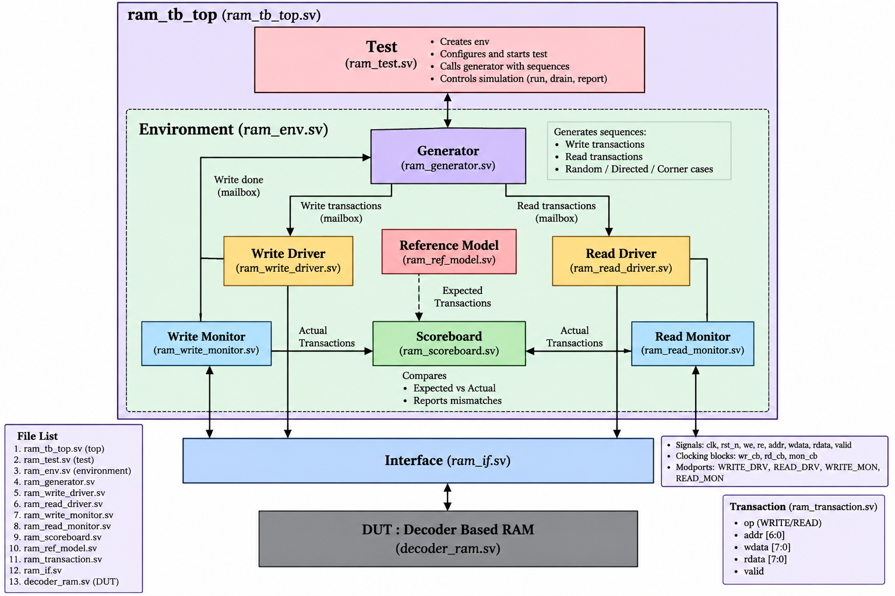

# Decoder-Based RAM Verification using SystemVerilog

A SystemVerilog verification environment for a decoder-based RAM, built and simulated in **Siemens QuestaSim 2024.1**. The project uses a modular, transaction-based architecture (driver, monitor, reference model, scoreboard) with both directed and constrained-random tests.

## Project Overview

**DUT:** Decoder-based RAM
- 128 memory locations
- 7-bit address, 8-bit data
- Address range: `0x00 – 0x7F`

**Verified aspects:**
- Read/write operation and address decoding
- Data storage & retrieval
- Memory block boundaries and isolation
- Same-address overwrites
- Address/data patterns (walking-0/1, checkerboard)
- Randomized and constrained-random accesses
- Read-before-write behavior

## Verification Architecture

```
TEST → ENVIRONMENT → GENERATOR → [WRITE DRIVER | READ DRIVER] → DUT
                                        ↓               ↓
                                [WRITE MONITOR  |  READ MONITOR]
                                        ↓
                                  SCOREBOARD ← REFERENCE MODEL
```


- **Generator** creates transactions, sent via mailboxes to drivers
- **Drivers** apply transactions to the DUT through a virtual interface (with clocking blocks/modports)
- **Monitors** observe DUT activity
- **Reference model** computes expected RAM behavior
- **Scoreboard** compares expected vs. actual results automatically

## Block Diagram


## Project Components

| Component | File | Description |
|---|---|---|
| DUT | `decoder_ram.sv` | Decoder-based RAM design |
| Interface | `ram_if.sv` | Connects testbench to DUT |
| Transaction | `ram_transaction.sv` | RAM transaction object |
| Generator | `ram_generator.sv` | Generates stimulus |
| Drivers | `ram_write_driver.sv`, `ram_read_driver.sv` | Drive write/read transactions |
| Monitors | `ram_write_monitor.sv`, `ram_read_monitor.sv` | Observe write/read operations |
| Reference Model | `ram_ref_model.sv` | Expected RAM behavior |
| Scoreboard | `ram_scoreboard.sv` | Compares expected vs. actual |
| Environment | `ram_env.sv` | Connects all components |
| Test | `ram_test.sv` | Controls test scenarios |
| Testbench Top | `ram_tb_top.sv` | Top-level simulation module |
| Regression Script | `regression.do` | Automates full regression |

## Test Suite (15 tests)

| Category | Tests |
|---|---|
| Data patterns | All-zero, all-one, checkerboard, walking-0/1 data |
| Address coverage | Full sweep, walking-0/1 address, toggle address |
| Randomization | Random, constrained-weighted random |
| Structural | Block boundary, block isolation |
| Behavioral | Same-address overwrite, read-before-write |

## Results

```
PASSED : 15
FAILED : 0
TOTAL  : 15
PASS RATE = 100%
```

**Transactions generated:** 912 writes, 797 reads (1,709 total)

## SystemVerilog Features Used

Classes & OOP, randomization & constraints (incl. weighted), mailboxes, virtual interfaces, clocking blocks/modports, transaction-based drivers/monitors, reference model, scoreboard, directed + constrained-random testing, regression automation, functional coverage (UCDB).

## Running the Project

**Single test:**
```tcl
vsim -c work.ram_tb_top "+TESTNAME=ram_random_test"
run -all
```

**Full regression:**
```tcl
do regression.do
```

## Tools Used

| Tool | Purpose |
|---|---|
| SystemVerilog | RTL verification & testbench |
| QuestaSim 2024.1 | Compilation & simulation |
| UCDB / vcover | Coverage database & reports |
| Git / GitHub | Version control & documentation |

## Future Improvements

- Cross coverage & coverage-driven stimulus
- SystemVerilog Assertions (SVA)
- Larger constrained-random regressions
- CI-based automated regression execution

## Author

**Chhavi Verma** — B.Tech, Electronics & Communication Engineering

Areas of interest: VLSI, RTL Design, Functional Verification, SystemVerilog, Digital Design
